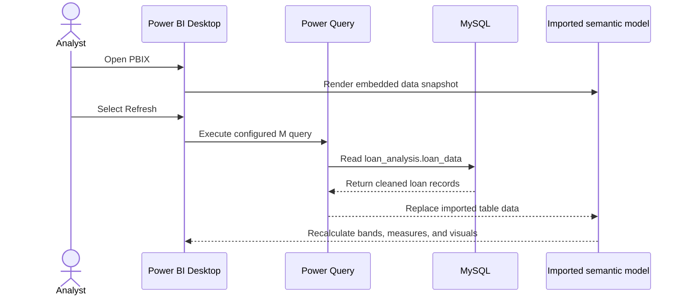

<div align="center">

# Loan Default Risk Analysis Dashboard

**An end-to-end credit-risk analytics project built with Python, MySQL, and Power BI.**

Explore where non-full-payment risk is concentrated across loan purpose, FICO score, debt-to-income ratio, revolving utilization, underwriting policy status, and recent credit inquiries.

[](https://github.com/nafishaparveen2104/Loan-Default-Risk-Analysis-Dashboard)
[](https://github.com/nafishaparveen2104/Loan-Default-Risk-Analysis-Dashboard/commits/main)
[](https://powerbi.microsoft.com/desktop/)
[](https://www.python.org/)
[](https://www.mysql.com/)
[](https://jupyter.org/)
[](https://www.kaggle.com/datasets/itssuru/loan-data)
[](#license)

[Dashboard](#dashboard) · [Key Findings](#key-findings) · [Architecture](#architecture) · [Quick Start](#quick-start) · [Data Dictionary](#data-dictionary) · [Limitations](#limitations)

</div>

---

## Overview

This repository turns 9,578 historical LendingClub loan records from 2007–2010 into a reproducible business-intelligence workflow:

1. **Python/Jupyter** profiles the raw data, validates quality, standardizes field names, and flags extreme outliers.
2. **MySQL** stores the cleaned dataset and supports repeatable portfolio queries.
3. **Power BI** adds a semantic layer of DAX measures and risk bands, then presents the results through an interactive dashboard.
4. **PDF and Word reports** translate the analysis into portfolio insights and recommendations.

The project is designed for **descriptive portfolio analysis**. It helps identify segments associated with elevated non-full-payment rates; it does not train a credit model, score new applications, or expose a prediction API.

> [!IMPORTANT]
> Throughout the project, “default” is used as a concise dashboard label for records where `not_fully_paid = 1`. The source field means the loan was not paid in full and should not be interpreted as a legally adjudicated default without additional source documentation.

### Portfolio at a glance

| Metric | Value |
|---|---:|
| Historical loan records | 9,578 |
| Not fully paid | 1,533 |
| Overall non-full-payment rate | 16.01% |
| Average FICO score | 710.85 |
| Average interest rate | 12.26% |
| Loans meeting the credit policy | 7,710 (80.50%) |
| Extreme-outlier flags retained | 439 (4.58%) |

> The Power BI KPI card displays `10K` because its display units are rounded automatically. The underlying row count is exactly **9,578**.

## Dashboard

<p align="center">
  <a href="https://ibb.co/ZCfmKDt">
    
  </a>
</p>

The single-page report combines four KPI cards, four slicers, four segmented risk charts, a credit-policy distribution chart, and a recent-inquiries trend. Selecting a purpose, FICO band, DTI band, or policy status updates the compatible visuals and portfolio metrics.

| Dashboard area | Question answered |
|---|---|
| KPI cards | How large is the portfolio, and what are its overall risk, FICO, and interest-rate levels? |
| Purpose slicer and chart | Which loan purposes have the highest non-full-payment rates? |
| FICO bands | How sharply does repayment performance differ by credit score? |
| DTI bands | Is higher borrower leverage associated with higher risk? |
| Revolving-utilization bands | How does credit-line usage relate to repayment performance? |
| Credit-policy donut | What share of records met the lender’s underwriting criteria? |
| Recent-inquiries line | How does observed risk vary with inquiries during the previous six months? |

<details>
<summary><strong>View individual dashboard analyses</strong></summary>

### Non-full-payment rate by loan purpose

<p align="center">
  <a href="https://ibb.co/r2sfSZ8B">
    
  </a>
</p>

### Non-full-payment rate by FICO band

<p align="center">
  <a href="https://ibb.co/1t6GrQY0">
    
  </a>
</p>

### Non-full-payment rate by DTI band

<p align="center">
  <a href="https://ibb.co/Dg4nXXgK">
    
  </a>
</p>

### Non-full-payment rate by revolving-utilization band

<p align="center">
  <a href="https://ibb.co/vx4QgZgK">
    
  </a>
</p>

### Loan distribution by credit-policy status

<p align="center">
  <a href="https://ibb.co/tWZcCyt">
    
  </a>
</p>

### Non-full-payment rate by recent inquiries

<p align="center">
  <a href="https://ibb.co/JWcy9PLc">
    
  </a>
</p>

</details>

## Key Findings

### Risk concentration by purpose

| Loan purpose | Records | Not fully paid | Rate |
|---|---:|---:|---:|
| Small business | 619 | 172 | **27.79%** |
| Educational | 343 | 69 | **20.12%** |
| Home improvement | 629 | 107 | 17.01% |
| All other | 2,331 | 387 | 16.60% |
| Debt consolidation | 3,957 | 603 | 15.24% |
| Credit card | 1,262 | 146 | 11.57% |
| Major purchase | 437 | 49 | **11.21%** |

Small-business loans have the highest observed rate—more than twice the rate for major-purchase loans. Purpose is therefore useful for portfolio segmentation, although this descriptive comparison does not control for differences in borrower characteristics.

### Risk-band comparison

| Dimension | Low | Medium | High |
|---|---:|---:|---:|
| FICO score | 23.62% | 15.63% | 7.43% |
| Debt-to-income ratio | 14.83% | 16.10% | 18.33% |
| Revolving utilization | 12.43% | 16.33% | 18.97% |

For FICO, “Low” represents the riskier score range and “High” represents the stronger score range. The observed rate falls from 23.62% below a FICO score of 680 to 7.43% at 750 and above.

### Underwriting-policy comparison

| Credit-policy status | Records | Portfolio share | Not fully paid | Rate |
|---|---:|---:|---:|---:|
| Meets criteria (`1`) | 7,710 | 80.50% | 1,014 | 13.15% |
| Does not meet criteria (`0`) | 1,868 | 19.50% | 519 | 27.78% |

Records outside the stated credit policy show an observed non-full-payment rate more than twice that of policy-compliant records. This supports monitoring policy exceptions as a distinct portfolio segment.

### Recent inquiries

The rate is 11.74% for borrowers with no inquiries, 20.83% at three inquiries, 27.34% at five, and 32.73% at six. Values above ten inquiries contain very few records, so the sharp spikes and drops in the chart are sample-size effects and should not be treated as a stable monotonic relationship.

## Architecture

```mermaid
flowchart LR
    A["Kaggle loan_data.csv<br/>9,578 rows · 14 columns"]
    B["Jupyter notebook<br/>Pandas + NumPy"]
    C["Validation and preparation<br/>rename · type check · outlier flag"]
    D["loan_data_cleaned.csv<br/>9,578 rows · 15 columns"]
    E["MySQL<br/>loan_analysis.loan_data"]
    F["Power Query<br/>MySQL.Database connector"]
    G["Power BI semantic model<br/>DAX measures + calculated bands"]
    H["Interactive dashboard<br/>KPIs · slicers · charts"]
    I["PDF and Word report"]

    A --> B --> C --> D --> E --> F --> G --> H --> I
```



### Request and refresh flow



### Design decisions

| Decision | Why it exists |
|---|---|
| Preserve every source row | Extreme values may represent genuine borrower behavior; 439 records are flagged rather than deleted. |
| Rename dotted columns | Underscore-based names are easier to use consistently in Python, SQL, Power Query, and DAX. |
| Use a single-table model | The source is already a compact analytical table and requires no relationships at its current scale. |
| Import data into Power BI | The small static dataset fits comfortably in the embedded columnar model and remains responsive during slicing. |
| Create risk bands in DAX | Business thresholds remain visible in the semantic layer and can be changed without rewriting the source CSV. |
| Separate raw and cleaned CSVs | The original data remains available for traceability while downstream tools consume a standardized schema. |

## Data Pipeline

### 1. Profiling and validation

[`Loan_Data.ipynb`](Loan_Data.ipynb) performs the following checks:

- confirms the raw shape of 9,578 rows and 14 columns;
- inspects data types, summary statistics, and seven purpose categories;
- verifies there are no missing values or duplicate rows;
- checks selected numeric fields for negative values;
- confirms the observed FICO range is 612–827;
- counts 1.5×IQR outliers for eight numeric fields;
- converts `purpose` to a categorical dtype during processing.

### 2. Standardization and outlier handling

Dots in raw field names are replaced with underscores. An `is_outlier` flag is then set to `1` when any of these fields falls outside its 3×IQR bounds:

- `revol_bal`
- `days_with_cr_line`
- `dti`

No rows are imputed, capped, or removed. The resulting [`loan_data_cleaned.csv`](loan_data_cleaned.csv) contains the original 9,578 records plus the outlier flag.

### 3. SQL analytical layer

[`Database-Loan_data.sql`](Database-Loan_data.sql) defines `loan_analysis.loan_data` and includes queries for:

- row-count and null validation;
- overall non-full-payment rate;
- purpose-level volume, interest rate, and risk;
- credit-policy comparisons;
- FICO-band performance;
- purpose-level installment, DTI, and log-income averages;
- recent-inquiry performance.

### 4. Power BI semantic layer

The PBIX imports one MySQL table and adds five calculated columns and eleven measures. There are no model relationships, row-level security roles, object-level security rules, calculation groups, or aggregation tables.

#### Calculated risk bands

| Calculated column | Definition |
|---|---|
| `fico_band` | Low: `< 680`; Medium: `680–749`; High: `≥ 750` |
| `dti_band` | Low: `< 10`; Medium: `10–< 20`; High: `≥ 20` |
| `revol_util_band` | Low: `< 30`; Medium: `30–< 60`; High: `≥ 60` |
| `interest_rate_band` | `5%–10%`, `10%–15%`, `15%–20%`, or `20%–25%`, using 10%, 15%, and 20% cutoffs |
| `fico_band_2` | Below 650, 650–699, 700–749, 750–799, or 800+ |

`interest_rate_band` and `fico_band_2` are available in the semantic model but are not used by the current dashboard visuals.

#### DAX measures

| Measure | Definition | Role |
|---|---|---|
| `Total Loans` | `COUNTROWS('loan_analysis loan_data')` | KPI and policy distribution |
| `Total Defaults` | `SUM('loan_analysis loan_data'[not_fully_paid])` | Supporting total |
| `Default Rate %` | `DIVIDE(SUM('loan_analysis loan_data'[not_fully_paid]), COUNTROWS('loan_analysis loan_data'), 0)` | KPI and segmented charts |
| `Avg FICO Score` | `AVERAGE('loan_analysis loan_data'[fico])` | KPI |
| `Avg Interest Rate %` | `AVERAGE('loan_analysis loan_data'[int_rate]) * 100` | KPI |
| `Avg Installment` | `AVERAGE('loan_analysis loan_data'[installment])` | Supporting analysis |
| `Avg DTI` | `AVERAGE('loan_analysis loan_data'[dti])` | Supporting analysis |
| `Avg Log Income` | `AVERAGE('loan_analysis loan_data'[log_annual_inc])` | Supporting analysis |
| `Avg Annual Income` | `AVERAGE('loan_analysis loan_data'[log_annual_inc])` | Legacy duplicate; see [Limitations](#limitations) |
| `Check Values` | `DISTINCTCOUNT('loan_analysis loan_data'[not_fully_paid])` | Data-quality check |
| `Total Rows Check` | `COUNTROWS('loan_analysis loan_data')` | Data-quality check |

## Technology Stack

| Layer | Technology | Use in this repository |
|---|---|---|
| Source data | CSV / Kaggle | Historical LendingClub loan records from 2007–2010 |
| Data preparation | Python, Pandas, NumPy | Profiling, validation, field normalization, and outlier flagging |
| Analysis environment | Google Colab / Jupyter Notebook | Executable preparation workflow and retained cell outputs |
| Database | MySQL | Table definition and portfolio-analysis queries |
| Data connector | Power Query M | Imports `loan_analysis.loan_data` from `localhost:3306` |
| Semantic model | Power BI / DAX | Measures, score bands, filter context, and imported storage |
| Visualization | Power BI Desktop | Interactive KPIs, slicers, bar charts, donut chart, and line chart |
| Reporting | PDF, DOCX | Shareable narrative findings and recommendations |

No package manifest is currently committed. The notebook directly imports `pandas`, `numpy`, and the Colab-specific `google.colab.files` helper.

## Repository Structure

| Path | Purpose |
|---|---|
| [`README.md`](README.md) | Project documentation and reproduction guide |
| [`loan_data.csv`](loan_data.csv) | Original 9,578-row source dataset with 14 columns |
| [`Loan_Data.ipynb`](Loan_Data.ipynb) | Colab-oriented profiling and cleaning notebook |
| [`loan_data_cleaned.csv`](loan_data_cleaned.csv) | Standardized 15-column dataset consumed by MySQL |
| [`Database-Loan_data.sql`](Database-Loan_data.sql) | MySQL schema and analytical queries |
| [`Loan_data_analysis_dashboard.pbix`](Loan_data_analysis_dashboard.pbix) | Power BI report, semantic model, and imported data snapshot |
| [`Loan_Default_Risk_Report.pdf`](Loan_Default_Risk_Report.pdf) | Final five-page analysis report |
| [`Loan_Default_Risk_Report.docx`](Loan_Default_Risk_Report.docx) | Editable report source |

## Quick Start

### Prerequisites

| Requirement | Needed for |
|---|---|
| Git | Clone the repository |
| Power BI Desktop | Open or edit the `.pbix` dashboard |
| Google Colab | Re-run the notebook without changing its Colab-specific upload/download cells |
| MySQL with local-file import enabled | Rebuild the analytical database |
| A compatible MySQL connector for Power BI | Refresh the PBIX from MySQL |

Exact runtime and package versions are not pinned in the current repository.

### 1. Clone the repository

```bash
git clone https://github.com/nafishaparveen2104/Loan-Default-Risk-Analysis-Dashboard.git
cd Loan-Default-Risk-Analysis-Dashboard
```

### 2. Open the dashboard

Open [`Loan_data_analysis_dashboard.pbix`](Loan_data_analysis_dashboard.pbix) in Power BI Desktop. The PBIX contains an imported data snapshot, so a database connection is not required to inspect the committed report.

### 3. Reproduce the cleaned dataset

Open the notebook in Colab, run all cells, and select `loan_data.csv` when the upload widget appears:

[](https://colab.research.google.com/github/nafishaparveen2104/Loan-Default-Risk-Analysis-Dashboard/blob/main/Loan_Data.ipynb)

The final cell writes and downloads `loan_data_cleaned.csv`. The committed notebook is Colab-oriented: `google.colab` upload and download calls will not run unchanged in a standard local Jupyter environment.

### 4. Build the MySQL database

The following commands target a fresh local schema and use the current repository’s SQL script. The script is not idempotent: it uses `CREATE DATABASE` and `CREATE TABLE` without `IF NOT EXISTS`.

```bash
mysql --local-infile=1 -u root -p < Database-Loan_data.sql

mysql --local-infile=1 -u root -p loan_analysis <<SQL
LOAD DATA LOCAL INFILE '$(pwd)/loan_data_cleaned.csv'
INTO TABLE loan_data
FIELDS TERMINATED BY ','
OPTIONALLY ENCLOSED BY '"'
LINES TERMINATED BY '\n'
IGNORE 1 LINES
(credit_policy, purpose, int_rate, installment, log_annual_inc, dti, fico, days_with_cr_line, revol_bal, revol_util, inq_last_6mths, delinq_2yrs, pub_rec, not_fully_paid, is_outlier);

SELECT
    COUNT(*) AS total_records,
    SUM(not_fully_paid) AS not_fully_paid_records,
    ROUND(AVG(not_fully_paid) * 100, 2) AS non_full_payment_rate_pct
FROM loan_data;
SQL
```

Expected validation values are 9,578 records, 1,533 not-fully-paid records, and a 16.01% rate. After loading the data, run the analytical statements in [`Database-Loan_data.sql`](Database-Loan_data.sql) again as needed.

If MySQL rejects `LOAD DATA LOCAL INFILE`, enable `local_infile` on the server and keep the client-side `--local-infile=1` option enabled.

### 5. Refresh Power BI from MySQL

The committed Power Query source is configured as follows:

| Setting | Value |
|---|---|
| Connector | `MySQL.Database` |
| Server | `localhost:3306` |
| Database | `loan_analysis` |
| Schema | `loan_analysis` |
| Table | `loan_data` |
| Storage | Imported model |

Start MySQL, open the PBIX, provide database credentials through Power BI’s data-source settings, and select **Refresh**. Credentials and passwords are not stored in the repository.

## Data Dictionary

The cleaned dataset uses underscore-separated names. Raw source names use dots, such as `credit.policy` and `not.fully.paid`.

| Field | Type | Description |
|---|---|---|
| `credit_policy` | Integer / binary | `1` if the borrower met LendingClub’s stated credit-underwriting criteria; otherwise `0` |
| `purpose` | Category | `all_other`, `credit_card`, `debt_consolidation`, `educational`, `home_improvement`, `major_purchase`, or `small_business` |
| `int_rate` | Decimal | Loan interest rate stored as a proportion; `0.1189` represents 11.89% |
| `installment` | Decimal | Monthly installment owed if the loan is funded |
| `log_annual_inc` | Decimal | Natural logarithm of self-reported annual income |
| `dti` | Decimal | Borrower debt-to-income ratio as supplied by the source |
| `fico` | Integer | Borrower FICO score |
| `days_with_cr_line` | Decimal | Number of days the borrower has had a credit line |
| `revol_bal` | Integer | Revolving balance unpaid at the end of the billing cycle |
| `revol_util` | Decimal | Revolving-line utilization percentage |
| `inq_last_6mths` | Integer | Creditor inquiries during the previous six months |
| `delinq_2yrs` | Integer | Payments 30 or more days past due during the previous two years |
| `pub_rec` | Integer | Derogatory public records, such as bankruptcies, tax liens, or judgments |
| `not_fully_paid` | Integer / binary | `1` if the loan was not paid in full; otherwise `0` |
| `is_outlier` | Integer / binary | `1` when `revol_bal`, `days_with_cr_line`, or `dti` is outside its 3×IQR bounds |

### Data-quality profile

| Check | Result |
|---|---:|
| Missing values | 0 |
| Duplicate rows | 0 |
| Negative values in selected financial fields | 0 |
| Raw FICO range | 612–827 |
| Raw interest-rate range | 6.00%–21.64% |
| Raw DTI range | 0.00–29.96 |
| Extreme outliers flagged | 439 |

A lightweight integrity check can be run with the Python standard library:

```bash
python - <<'PY'
import csv

with open("loan_data_cleaned.csv", newline="", encoding="utf-8") as file:
    rows = list(csv.DictReader(file))

assert len(rows) == 9_578
assert sum(int(row["not_fully_paid"]) for row in rows) == 1_533
assert sum(int(row["is_outlier"]) for row in rows) == 439
assert all(all(value != "" for value in row.values()) for row in rows)

print("Validated: 9,578 rows, 1,533 not fully paid, 439 outlier flags, no empty fields.")
PY
```

## Operational Scope

This repository is a local analytical project rather than a deployed application.

| Concern | Current implementation |
|---|---|
| API or web backend | Not present |
| Predictive model or inference service | Not present |
| Authentication | Delegated to local MySQL and Power BI; no application authentication layer |
| Row/object-level security | Not configured in the Power BI model |
| Environment variables | None; the PBIX source uses a hard-coded local host and database name |
| Secrets | No database password is committed; Power BI requests credentials locally |
| Caching | Power BI Import mode stores the small dataset in its embedded columnar model |
| Rate limiting | Not applicable; no network service is exposed |
| Logging | Notebook cell outputs and SQL query results only |
| Monitoring | Not configured |
| Automated tests | Not configured; notebook checks, SQL validation, and the integrity command above are manual |
| CI/CD | Not configured |
| Docker | Not configured |
| Cloud deployment | Not configured |
| Scheduled refresh | Not configured |

### Performance and scalability

The current single-table, 9,578-row dataset is well suited to an imported Power BI model and requires no aggregation layer or incremental refresh. For a larger or continuously updated portfolio, the next architecture should add parameterized data sources, indexed database tables, incremental refresh partitions, automated data-quality tests, and monitored refresh jobs.

### Security considerations

- The public dataset contains borrower attributes but no direct identifiers such as names, emails, or account numbers.
- The analysis still concerns financial behavior and should be handled according to the policies of any environment where it is republished.
- Publishing the report to Power BI Service would require deliberate workspace access controls, gateway configuration, credential management, and row-level security where appropriate; none are included here.
- This dashboard should not be used as an automated credit-decision system without governance, validation, fair-lending review, and current production data.

## Limitations

1. **Descriptive, not predictive.** No classifier, train/test split, feature-importance method, calibration analysis, or out-of-sample evaluation is implemented. “Strong predictors” in the accompanying report should be read as strong observed associations.
2. **Historical sample.** The data covers LendingClub records from 2007–2010 and may not represent present-day borrower populations, products, economic conditions, or underwriting rules.
3. **Outcome terminology.** `not_fully_paid` is a repayment outcome proxy, not a complete legal or accounting definition of default.
4. **Heuristic bands.** FICO, DTI, utilization, and interest-rate thresholds are hand-defined analytical segments, not statistically optimized cutoffs.
5. **Small high-inquiry groups.** Rates for large inquiry counts are unstable because some points represent only one or a few loans.
6. **Retained outliers.** Extreme values remain in the analysis. This preserves information but can affect averages and small segments.
7. **Rounded KPI.** Power BI currently abbreviates the total count to `10K`; the exact value is 9,578.
8. **Misnamed supporting measure.** `Avg Annual Income` averages `log_annual_inc`; it does not exponentiate the values back to currency. Use `Avg Log Income` until the measure is corrected.
9. **Local refresh dependency.** The PBIX expects MySQL at `localhost:3306`, which limits portability until the source is parameterized.
10. **No automated delivery controls.** Dependency locking, tests, CI, refresh monitoring, and deployment automation are not yet included.

## Roadmap

- [x] Profile and validate the raw dataset
- [x] Preserve raw data and publish a standardized analytical dataset
- [x] Add non-destructive extreme-outlier flags
- [x] Create a MySQL schema and reusable portfolio queries
- [x] Build an interactive Power BI dashboard and final report
- [ ] Move notebook logic into a reusable Python module or script
- [ ] Add a dependency manifest with pinned versions
- [ ] Make database creation and loading idempotent
- [ ] Parameterize the Power BI server, port, database, and table
- [ ] Correct the total-card display units and `Avg Annual Income` measure
- [ ] Add sample counts or confidence intervals to high-variance charts
- [ ] Add automated data-contract tests and continuous integration
- [ ] Add a repository-level open-source license and contribution policy
- [ ] Evaluate a separate predictive workflow with temporal validation, calibration, explainability, drift monitoring, and fairness testing

## Contributing

Contributions that improve reproducibility, analytical correctness, dashboard accessibility, or documentation are welcome.

1. Fork the repository and create a focused branch.
2. Keep the raw CSV unchanged; write transformed outputs to the cleaned dataset or a new documented artifact.
3. Preserve the 9,578-row baseline unless the contribution intentionally changes the data source.
4. Re-run notebook checks, SQL validation, and the integrity command before submitting a pull request.
5. Include screenshots for dashboard changes and document any DAX, Power Query, schema, or threshold changes.
6. Run the Markdown whitespace check below before committing.

```bash
git switch -c docs/improve-documentation
git diff --check
```

Use [GitHub Issues](https://github.com/nafishaparveen2104/Loan-Default-Risk-Analysis-Dashboard/issues) for defects, data questions, and enhancement proposals.

## Troubleshooting

<details>
<summary><strong>Power BI cannot refresh the MySQL source</strong></summary>

Confirm that MySQL is running on `localhost:3306`, the `loan_analysis` database contains the `loan_data` table, and the compatible MySQL connector is installed. Then clear or update permissions under Power BI’s data-source settings and authenticate again.

</details>

<details>
<summary><strong>MySQL rejects the CSV import</strong></summary>

Start the client with `--local-infile=1`, verify that the server permits `local_infile`, and use an absolute path to `loan_data_cleaned.csv`. Run the import from the repository root so `$(pwd)` resolves correctly.

</details>

<details>
<summary><strong>The notebook raises a <code>google.colab</code> import error</strong></summary>

The committed notebook uses Colab-specific file upload and download helpers. Open it through the **Open in Colab** badge, or adapt those two file-handling cells before using a local Jupyter runtime.

</details>

<details>
<summary><strong>The dashboard shows 10K loans instead of 9,578</strong></summary>

The card’s automatic display units abbreviate the exact count. Set the card visual’s display units to **None** in Power BI to show 9,578.

</details>

<details>
<summary><strong>Is this a loan-default prediction model?</strong></summary>

No. It is an exploratory and descriptive analytics dashboard. It summarizes historical outcomes and segment-level associations but does not generate borrower-level probabilities or decisions.

</details>

## Data Source and Attribution

The dataset is available from [ItsSuru’s Loan Data dataset on Kaggle](https://www.kaggle.com/datasets/itssuru/loan-data). Kaggle describes it as publicly available LendingClub data covering 2007–2010 and lists the dataset license as **Database: Open Database, Contents: Database Contents** under the [Open Data Commons Database Contents License 1.0](https://opendatacommons.org/licenses/dbcl/1-0/).

Please review the source page and its current terms before redistributing the data.

## License

This repository does **not** currently include a repository-level `LICENSE` file. In the absence of an explicit license, the project’s code, notebook, dashboard, SQL, documentation, and reports are not automatically granted open-source reuse rights. The dataset remains subject to its separately stated source license.

For reuse beyond GitHub’s standard viewing and forking functionality, contact the repository maintainer or wait for an explicit project license to be added.

## Maintainer

Maintained by [Nafisha Parveen](https://github.com/nafishaparveen2104).

If this analysis is useful, consider [starring the repository](https://github.com/nafishaparveen2104/Loan-Default-Risk-Analysis-Dashboard) or opening an issue with feedback.
