<div align="center">

# Loan Default Risk Analysis Dashboard

**A descriptive credit-risk analytics project built with Python, MySQL, DAX, and Power BI.**

It transforms 9,578 historical LendingClub loan records into an interactive dashboard for examining repayment risk across loan purpose, FICO score, debt-to-income ratio, revolving utilization, credit-policy status, and recent credit inquiries.

[](./Loan_data_analysis_dashboard.pbix)
[](./Loan_Data.ipynb)
[](./Loan_Data.ipynb)
[](./Database-Loan_data.sql)
[](https://www.kaggle.com/datasets/itssuru/loan-data)
[](https://github.com/nafishaparveen2104/Loan-Default-Risk-Analysis-Dashboard/commits/main)

[Interactive Dashboard](./Loan_data_analysis_dashboard.pbix) · [PDF Report](./Loan_Default_Risk_Report.pdf) · [Analysis Notebook](./Loan_Data.ipynb) · [Open in Colab](https://colab.research.google.com/github/nafishaparveen2104/Loan-Default-Risk-Analysis-Dashboard/blob/main/Loan_Data.ipynb) · [Source Dataset](https://www.kaggle.com/datasets/itssuru/loan-data)

</div>

<p align="center">
  <a href="https://ibb.co/ZCfmKDt">
    
  </a>
</p>

> [!NOTE]
> The dashboard abbreviates 9,578 loans as **10K** because the KPI card uses compact display units. All calculations use the complete 9,578-row dataset.

## Table of Contents

- [Overview](#overview)
- [Key Findings](#key-findings)
- [Dashboard Views](#dashboard-views)
- [Architecture](#architecture)
- [Data Pipeline](#data-pipeline)
- [Technology Stack](#technology-stack)
- [Repository Structure](#repository-structure)
- [Getting Started](#getting-started)
- [Configuration and Refresh](#configuration-and-refresh)
- [Power BI Semantic Model](#power-bi-semantic-model)
- [Data Dictionary](#data-dictionary)
- [Data Quality and Validation](#data-quality-and-validation)
- [Operational Characteristics](#operational-characteristics)
- [Limitations](#limitations)
- [Roadmap](#roadmap)
- [Troubleshooting](#troubleshooting)
- [Contributing](#contributing)
- [Dataset and License](#dataset-and-license)

## Overview

This repository is an end-to-end **data analytics and business intelligence project**. It answers a practical portfolio-management question: **which borrower and loan segments have historically shown the highest rates of non-payment?**

The workflow starts with public LendingClub data, validates and cleans it in a Google Colab notebook, stores the prepared table in MySQL, and imports it into a Power BI semantic model. DAX measures and calculated risk bands drive a single-page interactive dashboard and a written findings report.

The project is descriptive rather than predictive. In this analysis, `not_fully_paid = 1` is treated as the default-risk outcome; the repository does not train or deploy a credit-scoring model.

### Portfolio Snapshot

| Metric | Value | Definition |
|---|---:|---|
| Loan records | **9,578** | Complete records in the source and cleaned datasets |
| Not fully paid | **1,533** | Loans where `not_fully_paid = 1` |
| Overall default rate | **16.01%** | Not-fully-paid loans divided by all loans |
| Average FICO score | **710.85** | Displayed as 711 in the dashboard |
| Average interest rate | **12.26%** | Mean of `int_rate`, converted from a proportion to percent |
| Credit-policy compliant | **7,710 (80.50%)** | Records where `credit_policy = 1` |
| Credit-policy exceptions | **1,868 (19.50%)** | Records where `credit_policy = 0` |
| Extreme outliers flagged | **439 (4.58%)** | Records flagged with the notebook's 3×IQR rule; no rows were removed |

### What the Dashboard Supports

- Portfolio-level KPIs for volume, default rate, average FICO score, and average interest rate.
- Interactive filtering by loan purpose, FICO band, DTI band, and credit-policy status.
- Segment comparisons across seven loan purposes and three risk bands.
- Analysis of recent credit inquiries as an early risk signal.
- Separation of policy-compliant and policy-exception loans.
- A traceable path from raw data through cleaning, SQL analysis, semantic modeling, visualization, and reporting.

## Key Findings

### Default Risk by Loan Purpose

| Loan purpose | Loans | Not fully paid | Default rate |
|---|---:|---:|---:|
| Small business | 619 | 172 | **27.79%** |
| Educational | 343 | 69 | **20.12%** |
| Home improvement | 629 | 107 | **17.01%** |
| All other | 2,331 | 387 | **16.60%** |
| Debt consolidation | 3,957 | 603 | **15.24%** |
| Credit card | 1,262 | 146 | **11.57%** |
| Major purchase | 437 | 49 | **11.21%** |

Small-business loans have the highest observed non-payment rate, while major-purchase and credit-card loans have the lowest. These are historical associations and should not be interpreted as causal effects.

### Risk-Band Comparisons

| Dimension | Low | Medium | High | Observed pattern |
|---|---:|---:|---:|---|
| FICO score | 23.62% (`<680`) | 15.63% (`680–749`) | 7.43% (`≥750`) | Lower FICO scores show substantially higher default rates. |
| DTI ratio | 14.83% (`<10`) | 16.10% (`10–<20`) | 18.33% (`≥20`) | Default rates rise with borrower debt burden. |
| Revolving utilization | 12.43% (`<30`) | 16.33% (`30–<60`) | 18.97% (`≥60`) | Higher utilization is associated with higher default rates. |

### Credit-Policy Performance

| Credit-policy status | Loans | Not fully paid | Default rate |
|---|---:|---:|---:|
| Meets policy (`1`) | 7,710 | 1,014 | **13.15%** |
| Does not meet policy (`0`) | 1,868 | 519 | **27.78%** |

Policy-exception loans make up 19.50% of the portfolio and have more than twice the observed default rate of policy-compliant loans.

### Additional Observations

- The 439 extreme-outlier records have a **21.18%** default rate, compared with **15.76%** for non-outlier records.
- Default rates generally increase through the commonly populated recent-inquiry counts. Values at very high inquiry counts are volatile because some groups contain only one or two records.
- Interest-rate bands in the semantic model also separate risk: default rates range from **7.41%** in the 5%–10% band to **35.14%** in the 20%–25% band. Interest rates already reflect lender risk assessment, so this relationship should not be interpreted independently of underwriting.

## Dashboard Views

### Loan Purpose

<p align="center">
  <a href="https://ibb.co/r2sfSZ8B">
    
  </a>
</p>

### FICO Score Bands

<p align="center">
  <a href="https://ibb.co/1t6GrQY0">
    
  </a>
</p>

### Debt-to-Income Bands

<p align="center">
  <a href="https://ibb.co/Dg4nXXgK">
    
  </a>
</p>

### Revolving Credit Utilization

<p align="center">
  <a href="https://ibb.co/vx4QgZgK">
    
  </a>
</p>

### Credit-Policy Distribution

<p align="center">
  <a href="https://ibb.co/tWZcCyt">
    
  </a>
</p>

### Recent Credit Inquiries

<p align="center">
  <a href="https://ibb.co/JWcy9PLc">
    
  </a>
</p>

## Architecture

```mermaid
flowchart LR
    A["Kaggle / LendingClub<br/>loan_data.csv<br/>9,578 × 14"]
    B["Google Colab Notebook<br/>Pandas + NumPy"]
    C["loan_data_cleaned.csv<br/>9,578 × 15"]
    D["MySQL<br/>loan_analysis.loan_data"]
    E["Power Query<br/>MySQL import"]
    F["Power BI Semantic Model<br/>5 calculated columns<br/>11 DAX measures"]
    G["Interactive Dashboard<br/>KPIs + slicers + charts"]
    H["PDF / DOCX Report"]

    A -->|validate, rename, flag outliers| B
    B -->|export| C
    C -->|load into schema| D
    D -->|batch refresh| E
    E --> F
    F --> G
    G --> H
```



The Power BI file uses an imported, single-table model. This keeps the current 9,578-row workload simple and responsive, but refreshes depend on the configured MySQL source rather than a live API or streaming pipeline.

## Data Pipeline

| Stage | Input | Processing | Output |
|---|---|---|---|
| 1. Source | `loan_data.csv` | Load 14 columns from the public 2007–2010 lending dataset. | Raw DataFrame with 9,578 rows |
| 2. Profile | Raw DataFrame | Inspect shape, types, missing values, duplicates, ranges, categories, and summary statistics. | Data-quality profile |
| 3. Clean | Profiled data | Replace dots in column names with underscores and cast `purpose` to a categorical type. | SQL-friendly schema |
| 4. Validate | Cleaned data | Check negative values and confirm the observed FICO range is within the valid 300–850 range. | Validated records |
| 5. Flag | `revol_bal`, `days_with_cr_line`, and `dti` | Apply a 3×IQR extreme-outlier rule and retain the records with `is_outlier = 1`. | 439 flagged rows |
| 6. Persist | `loan_data_cleaned.csv` | Load the 15-column output into `loan_analysis.loan_data`. | MySQL analytics table |
| 7. Model | MySQL table | Import with Power Query; add DAX measures and calculated bands. | Power BI semantic model |
| 8. Present | Semantic model | Build interactive KPIs, slicers, and segment visualizations. | PBIX dashboard and written report |

> [!IMPORTANT]
> Outliers are **flagged, not deleted**. This preserves portfolio totals and lets analysts compare outlier and non-outlier behavior without silently discarding valid high-value observations.

## Technology Stack

| Layer | Technology | Role |
|---|---|---|
| Data source | Kaggle / LendingClub dataset | Historical loan and borrower attributes from 2007–2010 |
| Data preparation | Python, Pandas, NumPy | Profiling, validation, column normalization, and outlier flagging |
| Development environment | Google Colab / Jupyter Notebook | Executing and documenting the cleaning workflow |
| Database | MySQL | Persisting the cleaned analytics table and running portfolio queries |
| Data ingestion | Power Query M | Importing `loan_analysis.loan_data` from MySQL |
| Semantic layer | DAX | KPIs, validation measures, and reusable risk bands |
| Visualization | Microsoft Power BI Desktop | Interactive dashboard and cross-filtering |
| Reporting | Microsoft Word and PDF | Portable executive summary, findings, and recommendations |

Dependency versions are not pinned in the current repository. The notebook directly imports `pandas`, `numpy`, and `google.colab.files`.

## Repository Structure

| File | Purpose |
|---|---|
| [`Loan_Data.ipynb`](./Loan_Data.ipynb) | Colab-oriented data profiling and cleaning notebook |
| [`loan_data.csv`](./loan_data.csv) | Original 9,578-row, 14-column dataset |
| [`loan_data_cleaned.csv`](./loan_data_cleaned.csv) | Cleaned 15-column dataset with normalized names and `is_outlier` |
| [`Database-Loan_data.sql`](./Database-Loan_data.sql) | MySQL database/table definition and portfolio analysis queries |
| [`Loan_data_analysis_dashboard.pbix`](./Loan_data_analysis_dashboard.pbix) | Interactive Power BI dashboard and embedded semantic model |
| [`Loan_Default_Risk_Report.pdf`](./Loan_Default_Risk_Report.pdf) | Five-page portable analysis report |
| [`Loan_Default_Risk_Report.docx`](./Loan_Default_Risk_Report.docx) | Editable report source |
| `README.md` | Project documentation and reproducibility guide |

## Getting Started

### Prerequisites

| Requirement | Needed for |
|---|---|
| Git | Cloning the repository |
| Microsoft Power BI Desktop on Windows | Opening and editing the interactive `.pbix` dashboard |
| Google Colab | Running the notebook without local environment setup |
| MySQL Server and MySQL CLI or Workbench | Rebuilding the dashboard's database source |
| A Power BI-compatible MySQL driver | Refreshing the MySQL connection from Power BI Desktop |

### 1. Clone the Repository

```bash
git clone https://github.com/nafishaparveen2104/Loan-Default-Risk-Analysis-Dashboard.git
cd Loan-Default-Risk-Analysis-Dashboard
```

### 2. Choose a Workflow

#### View the Analysis

- Open [`Loan_data_analysis_dashboard.pbix`](./Loan_data_analysis_dashboard.pbix) in Power BI Desktop for the interactive experience.
- Open [`Loan_Default_Risk_Report.pdf`](./Loan_Default_Risk_Report.pdf) when Power BI Desktop is unavailable.
- Review the dashboard screenshots in this README from any platform.

The PBIX contains an imported data snapshot, so it can be inspected without first rebuilding MySQL. MySQL is required when refreshing the source.

#### Reproduce the Data Preparation

Open [`Loan_Data.ipynb`](./Loan_Data.ipynb) in [Google Colab](https://colab.research.google.com/github/nafishaparveen2104/Loan-Default-Risk-Analysis-Dashboard/blob/main/Loan_Data.ipynb), run the cells in order, and upload `loan_data.csv` when the first cell prompts for a file.

For local Jupyter, install the notebook dependencies first:

```bash
python -m pip install jupyter pandas numpy
jupyter notebook Loan_Data.ipynb
```

The upload and download cells use `google.colab.files`. When running locally, skip those two Colab-specific operations and keep `loan_data.csv` in the repository root.

### 3. Rebuild the MySQL Table

Run the repository's schema and analysis script against a MySQL instance:

```bash
mysql -u root -p < Database-Loan_data.sql
```

Then load the cleaned CSV from Bash or Git Bash. `local_infile` must be enabled for the client and server:

```bash
mysql --local-infile=1 -u root -p -e "
LOAD DATA LOCAL INFILE '$(pwd)/loan_data_cleaned.csv'
INTO TABLE loan_analysis.loan_data
FIELDS TERMINATED BY ','
OPTIONALLY ENCLOSED BY '\"'
LINES TERMINATED BY '\n'
IGNORE 1 LINES;
"
```

Validate the import:

```bash
mysql -u root -p loan_analysis -e "
SELECT
    COUNT(*) AS total_loans,
    SUM(not_fully_paid) AS total_defaults,
    ROUND(AVG(not_fully_paid) * 100, 2) AS default_rate_pct
FROM loan_data;
"
```

A complete import returns **9,578 loans**, **1,533 not-fully-paid loans**, and a **16.01% default rate**.

### 4. Refresh Power BI

1. Start MySQL and confirm that `loan_analysis.loan_data` is available.
2. Open `Loan_data_analysis_dashboard.pbix` in Power BI Desktop.
3. Go to **File → Options and settings → Data source settings**.
4. Update the MySQL source or credentials if your environment differs from `localhost:3306`.
5. Select **Refresh** and verify the four KPI cards against the expected values above.

## Configuration and Refresh

The repository has no environment variables or committed credentials. The source location is currently embedded in the Power Query definition.

| Setting | Current value | Notes |
|---|---|---|
| Connector | `MySQL.Database` | Used by Power Query |
| Host | `localhost:3306` | Hard-coded; update in Data Source Settings when necessary |
| Database | `loan_analysis` | Created by `Database-Loan_data.sql` |
| Table | `loan_data` | Contains the 15 cleaned fields |
| Storage mode | Import | Data is embedded in the PBIX and updated by refresh |
| Credentials | Not committed | Managed by Power BI Desktop and the local MySQL installation |
| Power BI parameters | None | Host and database are not parameterized |
| Environment variables | None | No `.env` file is required or read |

The exact Power Query expression embedded in the model is:

```powerquery
let
    Source = MySQL.Database("localhost:3306", "loan_analysis", [ReturnSingleDatabase=true]),
    loan_analysis_loan_data = Source{[Schema="loan_analysis", Item="loan_data"]}[Data]
in
    loan_analysis_loan_data
```

## Power BI Semantic Model

### Model Design

- **Model shape:** one imported table named `loan_analysis loan_data`.
- **Physical columns:** 15 fields loaded from MySQL.
- **Calculated columns:** 5 DAX-derived risk bands.
- **Measures:** 11 reusable DAX measures and data checks.
- **Relationships:** none; the model contains a single analytical table.
- **Dashboard page:** one 1,500 × 1,050 canvas with 17 visual containers.
- **Security roles:** no row-level or object-level security is configured.

### Calculated Columns

| Column | DAX grouping logic | Dashboard use |
|---|---|---|
| `fico_band` | Low `<680`; Medium `680–749`; High `≥750` | Slicer and default-rate chart |
| `dti_band` | Low `<10`; Medium `10–<20`; High `≥20` | Slicer and default-rate chart |
| `interest_rate_band` | 5%–10%, 10%–15%, 15%–20%, 20%–25% | Available in the model; not displayed on the current page |
| `revol_util_band` | Low `<30`; Medium `30–<60`; High `≥60` | Default-rate chart |
| `fico_band_2` | Below 650, 650–699, 700–749, 750–799, 800+ | Available for more granular analysis; not displayed on the current page |

### Measures

| Measure | Business logic | Used in current dashboard |
|---|---|---|
| `Total Loans` | Count all model rows | KPI card and policy donut |
| `Total Defaults` | Sum `not_fully_paid` | Available in model |
| `Default Rate %` | Defaults divided by total rows, with zero fallback | KPI and all default-rate charts |
| `Avg FICO Score` | Average `fico` | KPI card |
| `Avg Interest Rate %` | Average `int_rate` multiplied by 100 | KPI card |
| `Avg Annual Income` | Average `log_annual_inc` | Available in model; see limitation below |
| `Avg Installment` | Average monthly installment | Available in model |
| `Avg DTI` | Average debt-to-income ratio | Available in model |
| `Avg Log Income` | Average `log_annual_inc` | Available in model |
| `Check Values` | Distinct count of `not_fully_paid` | Data check; expected value is 2 |
| `Total Rows Check` | Count all model rows | Data check; expected value is 9,578 |

## Data Dictionary

| Field | Type | Description |
|---|---|---|
| `credit_policy` | Integer / binary | `1` when the borrower meets LendingClub's credit-underwriting criteria; otherwise `0` |
| `purpose` | Category | Loan purpose: all other, credit card, debt consolidation, educational, home improvement, major purchase, or small business |
| `int_rate` | Decimal proportion | Loan interest rate; `0.1189` represents 11.89% |
| `installment` | Decimal | Monthly installment owed by the borrower |
| `log_annual_inc` | Decimal | Natural logarithm of the borrower's self-reported annual income |
| `dti` | Decimal | Debt-to-income ratio |
| `fico` | Integer | Borrower's FICO credit score |
| `days_with_cr_line` | Decimal | Age of the borrower's credit line in days |
| `revol_bal` | Integer | Revolving balance remaining at the end of the billing cycle |
| `revol_util` | Decimal percent | Revolving-line utilization relative to available credit |
| `inq_last_6mths` | Integer | Creditor inquiries during the previous six months |
| `delinq_2yrs` | Integer | Payments 30 or more days past due during the previous two years |
| `pub_rec` | Integer | Derogatory public records, such as bankruptcies, tax liens, or judgments |
| `not_fully_paid` | Integer / binary | `1` when the loan was not fully paid; used as the analysis outcome |
| `is_outlier` | Integer / binary | Added by the notebook; `1` when any selected field exceeds the 3×IQR extreme-outlier boundary |

## Data Quality and Validation

The notebook records the following checks before exporting the cleaned dataset:

| Check | Result |
|---|---:|
| Raw shape | 9,578 rows × 14 columns |
| Cleaned shape | 9,578 rows × 15 columns |
| Missing values | 0 |
| Duplicate rows | 0 |
| Negative interest rate, installment, FICO, DTI, or revolving balance | 0 |
| Observed FICO range | 612–827 |
| Extreme outliers flagged | 439 |
| Rows removed | 0 |

The initial 1.5×IQR profile identifies potential outliers in interest rate, installment, log income, FICO score, credit-line age, and revolving balance. The exported `is_outlier` field deliberately uses the more conservative 3×IQR rule across `revol_bal`, `days_with_cr_line`, and `dti`.

These checks are notebook outputs, not an automated test suite. Re-run the notebook and compare the validation totals whenever the source data changes.

## Operational Characteristics

| Area | Current implementation |
|---|---|
| Query performance | Power BI Import mode stores the small single-table model in memory; DAX measures use simple aggregations. |
| Caching | The PBIX contains an imported snapshot. Data changes are visible only after refresh. |
| Scalability | Appropriate for the current 9,578-row dataset; no incremental refresh, partition strategy, or gateway configuration is included. |
| Error handling | Notebook checks expose invalid ranges, nulls, and duplicates; the SQL and refresh steps rely on client error messages. |
| Logging and monitoring | Notebook cell output and Power BI refresh status only; no centralized monitoring is configured. |
| Authentication | MySQL credentials are managed outside the repository. There is no application or API authentication layer. |
| Authorization | No Power BI row-level or object-level security roles are defined. |
| CI/CD | No automated pipeline is configured. PBIX, notebook, datasets, and reports are versioned directly in Git. |
| Containers | Docker is not used; Power BI Desktop remains a Windows desktop dependency. |
| Deployment | No hosted Power BI Service workspace or public embed URL is included. |

### Security Notes

- No database passwords, API keys, or environment files are committed.
- A PBIX can contain imported data and connection metadata. Review both before distributing the file outside a trusted environment.
- Configure row-level security, workspace permissions, a gateway, and credential rotation before adapting this project to confidential or production lending data.
- The included dataset is public and does not contain direct borrower identifiers, but production credit data requires stricter privacy and regulatory controls.

## Limitations

- **Descriptive analysis only:** no classifier, train/test split, feature importance, calibration, fairness evaluation, or production inference endpoint is implemented.
- **Outcome terminology:** `not_fully_paid` is used as a practical default proxy; it may not match every institution's formal default definition.
- **Historical scope:** the source covers LendingClub loans from 2007–2010 and may not represent current borrowers, products, underwriting policies, or macroeconomic conditions.
- **Sparse inquiry groups:** very high inquiry counts have tiny sample sizes. Apparent 0% or 100% rates in the line chart are not stable segment estimates.
- **Manual workflow:** Colab upload/download, CSV-to-MySQL import, and Power BI refresh are not orchestrated automatically.
- **Local data source:** the embedded Power Query points to `localhost:3306`, limiting portability until the source is changed or parameterized.
- **Measure naming:** `Avg Annual Income` averages `log_annual_inc`; it does not reverse the logarithm or return average income in currency units. `Avg Log Income` performs the same aggregation.
- **Floating-point storage:** the SQL schema uses `FLOAT` for decimal fields, which can introduce small representation differences.
- **No automated tests or CI:** validation is documented in notebook outputs but is not enforced on each commit.
- **No project license:** reuse terms for the repository's code, report, and dashboard have not yet been defined.

> [!CAUTION]
> This dashboard is an educational portfolio analysis. It should not be used as the sole basis for lending, pricing, adverse-action, or other high-impact decisions.

## Roadmap

- [ ] Parameterize the MySQL host, port, database, and table in Power Query.
- [ ] Add a reproducible Python environment with pinned dependencies.
- [ ] Refactor notebook transformations into a testable command-line pipeline.
- [ ] Add schema, range, row-count, and aggregate regression tests in CI.
- [ ] Convert the Power BI project to PBIP/TMDL for source-friendly semantic-model versioning.
- [ ] Replace raw high-inquiry categories with statistically meaningful bands and expose sample counts.
- [ ] Add confidence intervals and cohort-size warnings to segment comparisons.
- [ ] Correct the annual-income measure or rename it to reflect the logarithmic source field.
- [ ] Add Power BI Service deployment guidance, scheduled refresh, gateway setup, and row-level security.
- [ ] Add an explicit project license and contribution guidelines.
- [ ] If prediction becomes a goal, introduce leakage review, temporal validation, calibration, fairness testing, explainability, and model monitoring as a separate modeling workflow.

## Troubleshooting

| Problem | Resolution |
|---|---|
| `ModuleNotFoundError: google.colab` in local Jupyter | Run the notebook in Colab, or skip the Colab upload/download cells and read the repository's local CSV directly. |
| `LOAD DATA LOCAL INFILE` is disabled | Enable `local_infile` for the MySQL client/server, or import `loan_data_cleaned.csv` with MySQL Workbench's Table Data Import Wizard. |
| Power BI cannot connect to MySQL | Confirm that MySQL is running, the supported driver is installed, `localhost:3306` is reachable, and the credentials can access `loan_analysis`. |
| PBIX opens but refresh fails | The embedded snapshot can open independently; refresh still requires the configured MySQL table and valid local credentials. |
| Dashboard shows 10K instead of 9,578 | This is compact KPI formatting. `Total Rows Check` and the source table both contain exactly 9,578 rows. |
| `CREATE DATABASE` reports that the database exists | Use the existing `loan_analysis` database, or remove it only if you intend to rebuild the table from scratch. |
| Segment rates differ after editing thresholds | Review the five calculated-column definitions and refresh all visuals that use the affected bands. |

## Contributing

Contributions that improve reproducibility, data validation, semantic-model design, accessibility, or documentation are welcome.

1. Open an issue describing the proposed change and its effect on the published metrics.
2. Fork the repository and create a focused branch.
3. Keep raw source data unchanged; make transformations explicit in the notebook or pipeline.
4. Re-run the quality checks and confirm the 9,578-row baseline unless the dataset intentionally changes.
5. Update the PBIX, screenshots, and written report when a semantic definition or visual changes.
6. Submit a pull request with before-and-after metrics and clear refresh instructions.

For consistency, use `snake_case` for cleaned fields, keep DAX thresholds documented, avoid silent row deletion, and distinguish descriptive findings from predictive claims.

## Dataset and License

### Dataset

The analysis uses the [Loan Data dataset on Kaggle](https://www.kaggle.com/datasets/itssuru/loan-data), which describes publicly available LendingClub lending records from 2007–2010. The Kaggle data card identifies the dataset under the [Open Data Commons Database Contents License 1.0](https://opendatacommons.org/licenses/dbcl/1-0/).

Dataset attribution and licensing apply independently from this repository's source files.

### Repository License

This repository currently does **not** contain a `LICENSE` file. Until the maintainer adds one, the project code, dashboard, and reports do not carry an explicit open-source license. Add a license before redistributing or incorporating these materials into another project.

## Acknowledgements

- [ItsSuru](https://www.kaggle.com/itssuru) for publishing the dataset on Kaggle.
- LendingClub for the historical lending data described by the dataset source.
- The Pandas, NumPy, Jupyter, MySQL, and Microsoft Power BI ecosystems used to build the analysis.

---

<div align="center">

Built and maintained by [Nafisha Parveen](https://github.com/nafishaparveen2104).

</div>
