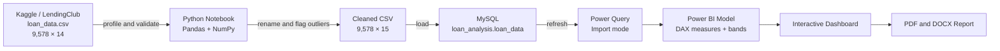

# Loan Default Risk Analysis Dashboard

<div align="center">

[](https://www.python.org/)
[](https://pandas.pydata.org/)
[](https://www.mysql.com/)
[](https://powerbi.microsoft.com/)
[](https://github.com/nafishaparveen2104/Loan-Default-Risk-Analysis-Dashboard)
[](#-license)

**An end-to-end credit-risk analytics project covering 9,578 historical loans, a MySQL analytical layer, and an interactive Power BI dashboard.**

[View Dashboard](#-dashboard-preview) • [Explore the Dataset](#-dataset) • [Review the Findings](#-key-findings) • [Reproduce the Project](#-reproducing-this-project)

</div>

---

## 🎯 Project Overview

This project analyzes historical LendingClub loan records to identify borrower and loan segments associated with higher rates of non-payment. It transforms a public 14-column dataset into a validated, SQL-ready table and an interactive Power BI dashboard covering portfolio KPIs, loan purpose, FICO score, debt-to-income ratio, revolving utilization, credit-policy status, and recent credit inquiries.

The workflow combines **Python and Pandas for data preparation**, **MySQL for structured analysis**, and **Power BI with DAX for semantic modeling and visualization**.

> **Analysis scope:** This is a descriptive business-intelligence project. It uses `not_fully_paid = 1` as the default-risk outcome but does not train or deploy a predictive credit-scoring model.

### Why This Project Matters

| Challenge | Solution |
|---|---|
| Credit risk is distributed unevenly across borrower segments | Compare default rates by purpose, FICO, DTI, utilization, policy status, and inquiries |
| Raw field names are inconvenient for SQL and BI tools | Normalize dotted column names to `snake_case` |
| Extreme observations can distort portfolio summaries | Flag 439 extreme outliers without deleting valid records |
| Static tables make segment comparison difficult | Provide interactive KPI cards, slicers, cross-filtering, and charts |
| Dashboard calculations can become inconsistent | Centralize portfolio logic in reusable DAX measures and calculated bands |
| Analytical results need a portable summary | Include editable DOCX and five-page PDF reports alongside the PBIX file |

### Key Questions Answered

- ✅ What is the portfolio's overall non-payment rate?
- ✅ Which loan purposes have the highest observed default rates?
- ✅ How does risk change across FICO, DTI, and revolving-utilization bands?
- ✅ How do policy-compliant and policy-exception loans perform?
- ✅ Do recent credit inquiries provide a useful early risk signal?
- ✅ Which records are extreme outliers, and how do they compare with the rest of the portfolio?

### Portfolio at a Glance

| Metric | Result |
|---|---:|
| Total loan records | **9,578** |
| Not fully paid | **1,533** |
| Overall default rate | **16.01%** |
| Average FICO score | **710.85** |
| Average interest rate | **12.26%** |
| Credit-policy compliant loans | **7,710 (80.50%)** |
| Credit-policy exception loans | **1,868 (19.50%)** |
| Extreme outliers flagged | **439 (4.58%)** |

---

## 📊 Dashboard Preview

### Portfolio Overview

<div align="center">


<p><em>Single-page portfolio view with four KPIs, four slicers, and six analytical visuals</em></p>

</div>

> **Note:** The KPI card abbreviates 9,578 records as **10K** because compact display units are enabled. The semantic model and source datasets contain exactly 9,578 rows.

---

### Default Rate by Loan Purpose

<div align="center">


<p><em>Small-business and educational loans show the highest observed non-payment rates</em></p>

</div>

---

### Default Rate by FICO Band

<div align="center">


<p><em>Lower-FICO borrowers have substantially higher historical default rates</em></p>

</div>

---

### Default Rate by Debt-to-Income Band

<div align="center">


<p><em>Default rates increase as borrower debt burden rises</em></p>

</div>

---

### Default Rate by Revolving Utilization

<div align="center">


<p><em>Higher revolving utilization is associated with higher non-payment risk</em></p>

</div>

---

### Loan Distribution by Credit Policy

<div align="center">


<p><em>80.5% of records meet the original LendingClub credit-policy criteria</em></p>

</div>

---

### Default Rate by Recent Credit Inquiries

<div align="center">


<p><em>Inquiry-level risk trend; extreme counts should be interpreted cautiously because their sample sizes are small</em></p>

</div>

> **Viewing recommendation:** Download [`Loan_data_analysis_dashboard.pbix`](./Loan_data_analysis_dashboard.pbix) and open it in Power BI Desktop for slicers, cross-filtering, and tooltips. The screenshots above are fixed previews.

---

## 📁 Dataset

**Raw file:** [`loan_data.csv`](./loan_data.csv)  
**Cleaned file:** [`loan_data_cleaned.csv`](./loan_data_cleaned.csv)  
**Records:** 9,578 loans  
**Raw dimensions:** 14 columns  
**Cleaned dimensions:** 15 columns  
**Power BI model:** 15 imported columns + 5 calculated columns  
**Time period:** 2007–2010  
**Source:** [Loan Data on Kaggle](https://www.kaggle.com/datasets/itssuru/loan-data)  
**Original context:** Publicly available LendingClub lending data

### Complete Cleaned Schema

| # | Column | Type | Description |
|---:|---|---|---|
| 1 | `credit_policy` | Integer / binary | `1` when the borrower meets LendingClub's credit-underwriting criteria; otherwise `0` |
| 2 | `purpose` | Category | Loan purpose: all other, credit card, debt consolidation, educational, home improvement, major purchase, or small business |
| 3 | `int_rate` | Float | Interest rate stored as a proportion; `0.1189` represents 11.89% |
| 4 | `installment` | Float | Monthly installment owed by the borrower |
| 5 | `log_annual_inc` | Float | Natural logarithm of self-reported annual income |
| 6 | `dti` | Float | Borrower's debt-to-income ratio |
| 7 | `fico` | Integer | Borrower's FICO credit score |
| 8 | `days_with_cr_line` | Float | Number of days the borrower has maintained a credit line |
| 9 | `revol_bal` | Integer | Revolving balance remaining at the end of the billing cycle |
| 10 | `revol_util` | Float | Revolving-line utilization as a percentage of available credit |
| 11 | `inq_last_6mths` | Integer | Creditor inquiries during the previous six months |
| 12 | `delinq_2yrs` | Integer | Payments 30 or more days late during the previous two years |
| 13 | `pub_rec` | Integer | Derogatory public records such as bankruptcies, tax liens, or judgments |
| 14 | `not_fully_paid` | Integer / binary | `1` when the loan was not fully paid; used as the analysis outcome |
| 15 | `is_outlier` | Integer / binary | `1` when a selected field exceeds the notebook's 3×IQR extreme-outlier boundary |

### Power BI Calculated Columns

| Column | Definition | Dashboard role |
|---|---|---|
| `fico_band` | Low `<680`; Medium `680–749`; High `≥750` | Slicer and default-rate chart |
| `dti_band` | Low `<10`; Medium `10–<20`; High `≥20` | Slicer and default-rate chart |
| `interest_rate_band` | 5%–10%, 10%–15%, 15%–20%, 20%–25% | Available for additional analysis |
| `revol_util_band` | Low `<30`; Medium `30–<60`; High `≥60` | Default-rate chart |
| `fico_band_2` | Below 650, 650–699, 700–749, 750–799, 800+ | Granular FICO analysis |

### Data Quality Checks

The notebook verifies:

- ✅ **Zero duplicate rows** — confirmed with `df.duplicated().sum()`
- ✅ **Zero missing values** — confirmed across all source and cleaned fields
- ✅ **Valid FICO range** — observed values are between 612 and 827
- ✅ **No negative values** — verified for interest rate, installment, FICO, DTI, and revolving balance
- ✅ **Consistent loan-purpose categories** — seven categories identified
- ✅ **Stable row count** — 9,578 source rows and 9,578 cleaned rows
- ✅ **Outlier preservation** — 439 extreme observations flagged; no rows deleted

---

## 🛠️ Tech Stack

| Area | Technology | Purpose |
|---|---|---|
| Data processing | Python, Pandas, NumPy | Profiling, validation, column normalization, and outlier flagging |
| Notebook environment | Google Colab / Jupyter Notebook | Interactive execution and documented analysis |
| Database | MySQL | Cleaned-table storage and analytical SQL queries |
| Data ingestion | Power Query M | Importing the MySQL table into Power BI |
| Semantic modeling | DAX | KPIs, risk bands, validation measures, and reusable calculations |
| Business intelligence | Power BI Desktop | Dashboard design, slicers, tooltips, and cross-filtered visuals |
| Reporting | Microsoft Word and PDF | Editable and portable findings reports |
| Version control | Git and GitHub | Source history and portfolio hosting |

---

## 🏗️ Architecture and Data Flow



### Power BI Source Configuration

| Setting | Current value |
|---|---|
| Connector | `MySQL.Database` |
| Host | `localhost:3306` |
| Database | `loan_analysis` |
| Table | `loan_data` |
| Storage mode | Import |
| Power BI parameters | None |
| Environment variables | None |
| Credentials in repository | None |

The PBIX contains an imported data snapshot. It can be opened without MySQL, but refreshing it requires a compatible local MySQL source and valid credentials.

---

## 📂 Project Structure

| File | Description |
|---|---|
| [`Loan_Data.ipynb`](./Loan_Data.ipynb) | Jupyter/Colab notebook containing the complete profiling and cleaning workflow |
| [`loan_data.csv`](./loan_data.csv) | Original 9,578-row dataset with dotted source column names |
| [`loan_data_cleaned.csv`](./loan_data_cleaned.csv) | Cleaned dataset with SQL-friendly names and `is_outlier` |
| [`Database-Loan_data.sql`](./Database-Loan_data.sql) | MySQL schema plus portfolio, purpose, FICO, DTI, and inquiry queries |
| [`Loan_data_analysis_dashboard.pbix`](./Loan_data_analysis_dashboard.pbix) | Interactive Power BI dashboard and semantic model |
| [`Loan_Default_Risk_Report.pdf`](./Loan_Default_Risk_Report.pdf) | Five-page portable analysis report |
| [`Loan_Default_Risk_Report.docx`](./Loan_Default_Risk_Report.docx) | Editable report source |
| `README.md` | Project documentation |

---

## 🔧 Data Cleaning Pipeline

The cleaning workflow is documented in [`Loan_Data.ipynb`](./Loan_Data.ipynb). It preserves all source records while creating a consistent schema for MySQL and Power BI.

### Step 1: Load and Inspect the Data

```python
import pandas as pd

# Load the raw dataset.
df = pd.read_csv("loan_data.csv")

print("Shape:", df.shape)
print("Columns:", df.columns.tolist())
print("Data types:\n", df.dtypes)
print(df.head())
```

**Expected result:** 9,578 rows × 14 columns.

---

### Step 2: Check Missing Values and Duplicates

```python
print("Missing values:\n", df.isnull().sum())
print("Duplicate rows:", df.duplicated().sum())
print(df.describe())
```

**Expected result:** zero missing values and zero duplicate rows.

---

### Step 3: Normalize Column Names

```python
# Convert dotted source names into SQL-friendly snake_case names.
df.columns = df.columns.str.replace(".", "_", regex=False)

# Store the finite set of purposes efficiently.
df["purpose"] = df["purpose"].astype("category")

print(df.columns.tolist())
print(df.dtypes)
```

**Why:** Fields such as `credit.policy` and `not.fully.paid` become `credit_policy` and `not_fully_paid`, which are easier to use in SQL, DAX, and Python.

---

### Step 4: Validate Numeric Ranges

```python
for column in ["int_rate", "installment", "fico", "dti", "revol_bal"]:
    negative_count = (df[column] < 0).sum()
    print(f"{column}: {negative_count} negative values")

print("FICO range:", df["fico"].min(), "-", df["fico"].max())
```

**Expected result:** zero negative values in the checked fields and an observed FICO range of 612–827.

---

### Step 5: Profile Potential Outliers

```python
numeric_columns = [
    "int_rate",
    "installment",
    "log_annual_inc",
    "dti",
    "fico",
    "days_with_cr_line",
    "revol_bal",
    "revol_util",
]

for column in numeric_columns:
    q1 = df[column].quantile(0.25)
    q3 = df[column].quantile(0.75)
    iqr = q3 - q1
    lower_bound = q1 - 1.5 * iqr
    upper_bound = q3 + 1.5 * iqr
    outlier_count = ((df[column] < lower_bound) | (df[column] > upper_bound)).sum()
    print(f"{column}: {outlier_count} potential outliers")
```

**Why:** The 1.5×IQR profile exposes unusual values without changing the dataset.

---

### Step 6: Flag Extreme Outliers

```python
df["is_outlier"] = 0

for column in ["revol_bal", "days_with_cr_line", "dti"]:
    q1 = df[column].quantile(0.25)
    q3 = df[column].quantile(0.75)
    iqr = q3 - q1
    lower_bound = q1 - 3 * iqr
    upper_bound = q3 + 3 * iqr

    mask = (df[column] < lower_bound) | (df[column] > upper_bound)
    df.loc[mask, "is_outlier"] = 1

print("Extreme outliers flagged:", df["is_outlier"].sum())
```

**Expected result:** 439 records flagged. The records remain in the dataset.

---

### Step 7: Export the Cleaned Dataset

```python
print("Final shape:", df.shape)
print("Remaining null values:", df.isnull().sum().sum())

df.to_csv("loan_data_cleaned.csv", index=False)
print("Cleaned data exported successfully")
```

**Expected result:** `loan_data_cleaned.csv` with 9,578 rows × 15 columns.

---

## 📈 Dashboard Features

The Power BI file [`Loan_data_analysis_dashboard.pbix`](./Loan_data_analysis_dashboard.pbix) contains one focused interactive page.

| Component | Content | Implementation |
|---|---|---|
| KPI cards | Total loans, default rate, average FICO, average interest rate | DAX measures |
| Purpose analysis | Default rate across seven loan-purpose categories | Clustered bar chart |
| FICO analysis | Default rate across Low, Medium, and High bands | Calculated column + bar chart |
| DTI analysis | Default rate across Low, Medium, and High bands | Calculated column + bar chart |
| Utilization analysis | Default rate by revolving-utilization band | Calculated column + bar chart |
| Credit-policy mix | Policy-compliant versus policy-exception loan distribution | Donut chart |
| Inquiry analysis | Default rate by inquiries during the previous six months | Line chart |
| Slicers | Purpose, FICO band, DTI band, and credit policy | Interactive filters |

### Interactive Capabilities

- **Cross-filtering:** Select a visual or slicer value to update related metrics.
- **Slicers:** Filter by loan purpose, FICO band, DTI band, or credit-policy status.
- **Tooltips:** Hover over data points to inspect detailed values.
- **Reusable DAX:** Centralized measures keep KPI and chart calculations consistent.
- **Imported snapshot:** Open and review the dashboard even when the original MySQL server is unavailable.

### DAX Measures

| Measure | Business logic | Dashboard use |
|---|---|---|
| `Total Loans` | Count all model rows | KPI and policy donut |
| `Total Defaults` | Sum `not_fully_paid` | Semantic model |
| `Default Rate %` | Total defaults divided by total loans, with zero fallback | KPI and risk charts |
| `Avg FICO Score` | Average FICO score | KPI |
| `Avg Interest Rate %` | Average interest-rate proportion multiplied by 100 | KPI |
| `Avg Installment` | Average monthly installment | Semantic model |
| `Avg DTI` | Average debt-to-income ratio | Semantic model |
| `Avg Log Income` | Average `log_annual_inc` | Semantic model |
| `Check Values` | Distinct count of the binary outcome | Validation |
| `Total Rows Check` | Count all model rows | Validation |

The model also contains `Avg Annual Income`, which currently averages `log_annual_inc`; it should be renamed or transformed before being interpreted as currency.

---

## 🔍 Key Findings

### Loan-Purpose Comparison

| Loan purpose | Loans | Not fully paid | Default rate | Interpretation |
|---|---:|---:|---:|---|
| Small business | 619 | 172 | **27.79%** | Highest observed purpose-level risk |
| Educational | 343 | 69 | **20.12%** | Above the portfolio average |
| Home improvement | 629 | 107 | **17.01%** | Moderately above average |
| All other | 2,331 | 387 | **16.60%** | Close to the portfolio average |
| Debt consolidation | 3,957 | 603 | **15.24%** | Largest segment by volume |
| Credit card | 1,262 | 146 | **11.57%** | Below the portfolio average |
| Major purchase | 437 | 49 | **11.21%** | Lowest observed purpose-level risk |

### Risk-Band Comparison

| Dimension | Low | Medium | High | Finding |
|---|---:|---:|---:|---|
| FICO score | 23.62% (`<680`) | 15.63% (`680–749`) | 7.43% (`≥750`) | FICO produces the largest separation among the displayed three-band views |
| DTI ratio | 14.83% (`<10`) | 16.10% (`10–<20`) | 18.33% (`≥20`) | Default rate rises with debt burden |
| Revolving utilization | 12.43% (`<30`) | 16.33% (`30–<60`) | 18.97% (`≥60`) | Higher utilization is associated with higher risk |

### Additional Portfolio Insights

| Metric | Finding | Business implication |
|---|---|---|
| Credit policy | Policy exceptions default at **27.78%**, versus **13.15%** for compliant loans | Monitor exceptions separately and review approval criteria |
| Outlier flag | Flagged records default at **21.18%**, versus **15.76%** for other records | Keep an outlier review path without automatically excluding valid applications |
| Interest-rate bands | Default rates range from **7.41%** at 5%–10% to **35.14%** at 20%–25% | Existing loan pricing reflects substantial risk differentiation |
| Recent inquiries | Risk generally rises through commonly populated inquiry counts | Use inquiries as a supporting signal, not a standalone decision rule |
| Sparse inquiry groups | Some high-count groups contain only one or two records | Avoid treating 0% or 100% values as stable estimates |

> These findings describe historical associations. They do not establish causation and are not validated predictions for future borrowers.

---

## 🚀 Reproducing This Project

### Prerequisites

- **Git** for cloning the repository
- **Python 3** with `pip`
- **Google Colab** or **Jupyter Notebook** for the cleaning workflow
- **MySQL Server** with the MySQL CLI or Workbench for database reconstruction
- **Power BI Desktop** on Windows for the interactive dashboard
- A **Power BI-compatible MySQL driver** when refreshing the database source

### Step 1: Clone the Repository

```bash
git clone https://github.com/nafishaparveen2104/Loan-Default-Risk-Analysis-Dashboard.git
cd Loan-Default-Risk-Analysis-Dashboard
```

### Step 2: Set Up the Python Environment

Create a virtual environment:

```bash
python -m venv .venv
```

Activate it on macOS or Linux:

```bash
source .venv/bin/activate
```

Or activate it in Windows PowerShell:

```powershell
.venv\Scripts\Activate.ps1
```

Install the notebook dependencies after activation:

```bash
python -m pip install --upgrade pip
python -m pip install pandas numpy jupyter
```

### Step 3: Run the Notebook

#### Option A: Google Colab

Open [`Loan_Data.ipynb`](https://colab.research.google.com/github/nafishaparveen2104/Loan-Default-Risk-Analysis-Dashboard/blob/main/Loan_Data.ipynb), run the cells in order, and upload `loan_data.csv` when prompted.

#### Option B: Local Jupyter

```bash
jupyter notebook Loan_Data.ipynb
```

The notebook contains `google.colab.files` upload and download operations. When running locally, skip those operations and keep `loan_data.csv` in the project root.

> **Shortcut:** The cleaned CSV is already included. Skip directly to the MySQL or Power BI steps if you only want to inspect the finished analysis.

### Step 4: Create the MySQL Schema

```bash
mysql -u root -p < Database-Loan_data.sql
```

The script creates `loan_analysis.loan_data` and includes analytical queries for totals, purpose, FICO bands, DTI, credit policy, and recent inquiries.

### Step 5: Load the Cleaned CSV

Run this command from Bash or Git Bash with MySQL `local_infile` enabled:

```bash
mysql --local-infile=1 -u root -p -e "
LOAD DATA LOCAL INFILE '$(pwd)/loan_data_cleaned.csv'
INTO TABLE loan_analysis.loan_data
FIELDS TERMINATED BY ','
OPTIONALLY ENCLOSED BY '\"'
LINES TERMINATED BY '\n'
IGNORE 1 LINES;
"
```

Validate the database totals:

```bash
mysql -u root -p loan_analysis -e "
SELECT
    COUNT(*) AS total_loans,
    SUM(not_fully_paid) AS total_defaults,
    ROUND(AVG(not_fully_paid) * 100, 2) AS default_rate_pct
FROM loan_data;
"
```

**Expected output:** 9,578 total loans, 1,533 defaults, and a 16.01% default rate.

### Step 6: Open and Refresh the Dashboard

1. Open `Loan_data_analysis_dashboard.pbix` in Power BI Desktop.
2. To inspect the embedded snapshot, no database connection is required.
3. To refresh, start MySQL and verify `loan_analysis.loan_data` is available.
4. Open **File → Options and settings → Data source settings**.
5. Update the current `localhost:3306` source and credentials when necessary.
6. Select **Refresh** and compare the KPI cards with the expected totals.

---

## 📦 Dependencies

The repository does not currently include a pinned `requirements.txt` or lock file.

| Package | Used for |
|---|---|
| `pandas` | CSV loading, profiling, transformations, validation, and export |
| `numpy` | Numerical-analysis support in the notebook |
| `jupyter` | Local notebook execution |
| `google.colab` | File upload and download when running in Colab |

Install the local dependencies with:

```bash
python -m pip install pandas numpy jupyter
```

Power BI Desktop and MySQL are installed separately from their official distributions.

---

## ✅ Validation and Engineering Status

| Area | Current status |
|---|---|
| Missing-value checks | Implemented in notebook |
| Duplicate detection | Implemented in notebook |
| Range checks | Implemented for selected financial fields and FICO |
| Outlier handling | Extreme values flagged and retained |
| SQL validation | Row-count, default-rate, segment, and inquiry queries included |
| Automated tests | Not configured |
| CI/CD | Not configured |
| Logging | Notebook output and Power BI refresh status only |
| Monitoring | Not configured |
| Docker | Not used |
| Power BI Service deployment | Not included |
| Row-level security | Not configured |
| Credentials committed | None detected |

### Security Notes

- Database credentials are managed outside the repository.
- The PBIX includes imported data and connection metadata; review it before external distribution.
- Add workspace permissions, row-level security, gateway controls, and credential rotation before adapting the project to confidential lending data.
- The included public dataset has no direct borrower identifiers, but real credit data requires stronger privacy, governance, and regulatory controls.

---

## ⚠️ Limitations and Responsible Use

- The source covers LendingClub records from **2007–2010** and may not represent present-day borrowers, products, underwriting rules, or economic conditions.
- `not_fully_paid` is used as a default proxy and may not match an institution's formal delinquency or charge-off definition.
- No classification model, temporal validation, feature-importance analysis, calibration, fairness testing, or inference API is included.
- High recent-inquiry categories have very small samples, producing unstable 0% or 100% rates.
- The notebook workflow, CSV import, and Power BI refresh remain manual.
- Power Query points to `localhost:3306`, so refresh is not portable until the source is parameterized.
- `Avg Annual Income` currently averages a logarithmic field and should not be interpreted as currency.
- The MySQL schema stores decimal measures as `FLOAT`, which can introduce small representation differences.
- No automated tests, CI pipeline, hosted dashboard, or project license are currently included.

> **Responsible-use notice:** This project is intended for education and portfolio demonstration. It should not be used as the sole basis for lending, pricing, adverse-action, or other high-impact decisions.

---

## 🎓 Skills Demonstrated

<div align="center">

`Data Cleaning` `Data Validation` `Data Profiling` `Outlier Analysis` `Pandas` `Python` `Jupyter Notebook` `Google Colab` `MySQL` `SQL` `Power Query` `DAX` `Power BI` `Data Visualization` `Business Intelligence` `Credit Risk Analysis` `Dashboard Design` `Data Storytelling` `Technical Documentation` `Git` `GitHub`

</div>

---

## 🔮 Future Enhancements

- [ ] Parameterize the MySQL host, port, database, and table in Power Query.
- [ ] Add pinned Python dependencies and a reproducible environment file.
- [ ] Convert notebook transformations into a testable command-line pipeline.
- [ ] Add schema, range, row-count, and aggregate regression tests.
- [ ] Configure GitHub Actions for automated validation.
- [ ] Convert the PBIX project to PBIP/TMDL for source-friendly version control.
- [ ] Add sample counts and confidence intervals to risk-segment visuals.
- [ ] Replace sparse inquiry values with statistically meaningful bands.
- [ ] Correct or rename the annual-income measure.
- [ ] Add Power BI Service deployment, gateway setup, scheduled refresh, and row-level security.
- [ ] Add an explicit repository license and contribution guide.
- [ ] Build a separate predictive workflow only after leakage review, temporal validation, calibration, explainability, and fairness testing.

---

## 🧰 Troubleshooting

| Problem | Resolution |
|---|---|
| `ModuleNotFoundError: google.colab` | Run the notebook in Colab, or skip the Colab-specific upload/download operations locally. |
| `LOAD DATA LOCAL INFILE` is disabled | Enable `local_infile`, or import the cleaned CSV with MySQL Workbench's Table Data Import Wizard. |
| Power BI cannot connect to MySQL | Confirm MySQL is running, install a supported driver, verify `localhost:3306`, and check database permissions. |
| PBIX opens but refresh fails | The embedded snapshot opens independently; refresh still requires the configured MySQL source and credentials. |
| KPI shows 10K rather than 9,578 | Compact display units are enabled. The underlying `Total Loans` measure returns 9,578. |
| Database already exists | Use the existing `loan_analysis` database, or remove it only when intentionally rebuilding the table. |
| Segment rates changed | Confirm the DAX band thresholds and ensure all visuals were refreshed after the change. |

---

## 👤 Author

<div align="center">

**Nafisha Parveen**  
*Aspiring Data Analyst*

[](https://github.com/nafishaparveen2104)
[](https://github.com/nafishaparveen2104)

**Core stack:** Python · Pandas · NumPy · Jupyter · SQL · MySQL · Power BI · Power Query · DAX

</div>

---

## 📄 License

This repository currently does **not** contain a `LICENSE` file. The project code, dashboard, and reports therefore do not have an explicit open-source license. Add a license before redistributing or incorporating these materials into another project.

The source dataset is licensed separately. The Kaggle data card identifies it under the [Open Data Commons Database Contents License 1.0](https://opendatacommons.org/licenses/dbcl/1-0/).

---

## 🙏 Acknowledgments

- [ItsSuru](https://www.kaggle.com/itssuru) for publishing the loan dataset on Kaggle.
- LendingClub for the historical lending records described by the dataset source.
- The Pandas, NumPy, Jupyter, MySQL, and Microsoft Power BI ecosystems used to build the analysis.
- The data analytics community for established practices in reproducibility, visualization, and responsible credit-risk analysis.

---

<div align="center">

⭐ **If this project was useful, consider starring the repository.**

[Back to Top](#loan-default-risk-analysis-dashboard)

</div>
